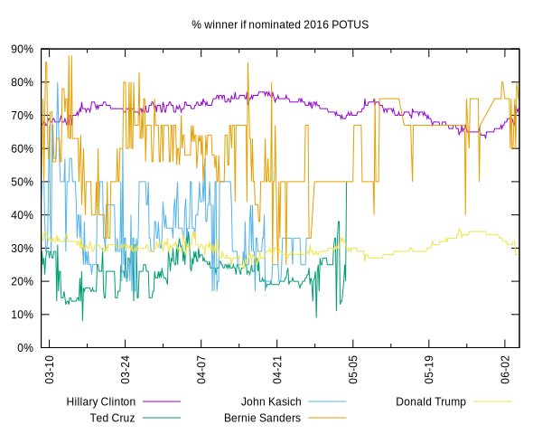

Everyone's interested in a current horse race, but what about its
impact on the next horse race, or better,
[broad](http://socialgoals.blogspot.com/2015/07/targeting-surrogate-indicators.html),
[non-manipulable](http://socialgoals.blogspot.com/2015/08/hidden-metrics.html),
and
[non-financialized](http://socialgoals.blogspot.com/2014/10/gdp-versus-mental-well-being.html)
social goals?

Maybe gather and analyze some data here.

The 2016 POTUS nomination horse race and the upcoming general
election horse race:

Old related commentary:

* http://gondwanaland.com/mlog/2008/11/02/futarchist-voter-guide/
* http://gondwanaland.com/mlog/2004/11/02/bush-good-for-terrorist-stocks/
* http://gondwanaland.com/mlog/2004/09/26/markets-and-election-outcomes/
